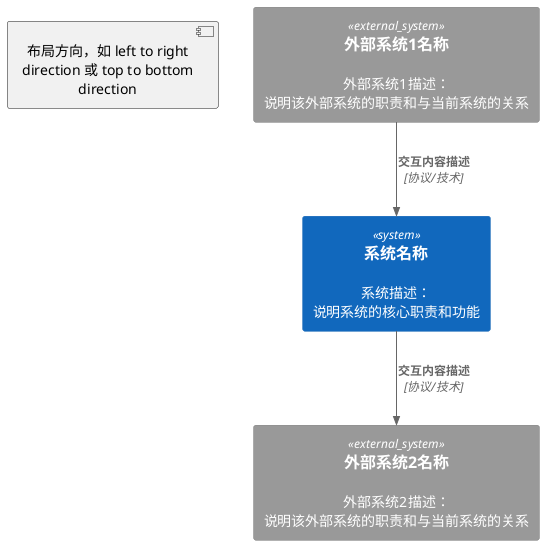

# 系统上下文

[系统上下文的详细描述，包括：
- 系统的定位和职责
- 系统在整体架构中的位置
- 与外部系统的交互关系概述
]

## 上下文图

[使用PlantUML C4 Context图描述系统与外部系统的交互关系]

## 系统说明

### 当前系统
- **系统名称**: [系统名称]
- **系统职责**: [系统的核心职责和主要功能]
- **系统定位**: [系统在整个架构中的定位和作用]

### 外部系统列表

#### 外部系统1
- **系统名称**: [外部系统名称]
- **系统类型**: [系统类型，如 外部系统、第三方系统、上游系统、下游系统等]
- **系统职责**: [该外部系统的核心职责]
- **交互关系**: [与当前系统的交互关系描述]

#### 外部系统2
- **系统名称**: [外部系统名称]
- **系统类型**: [系统类型]
- **系统职责**: [该外部系统的核心职责]
- **交互关系**: [与当前系统的交互关系描述]

## 交互关系说明

### 交互关系1
- **交互双方**: [系统A] ↔ [系统B]
- **交互内容**: [交互的具体内容，如 心跳请求/响应、订阅同步、查询请求等]
- **交互方向**: [单向/双向]
- **协议/技术**: [使用的协议或技术，如 UDP/IP、UCOM消息、HTTP/2等]
- **交互场景**: [在什么场景下进行交互]

### 交互关系2
- **交互双方**: [系统A] ↔ [系统B]
- **交互内容**: [交互的具体内容]
- **交互方向**: [单向/双向]
- **协议/技术**: [使用的协议或技术]
- **交互场景**: [在什么场景下进行交互]

## 协议与技术栈（可选）

[列出系统与外部系统交互使用的协议和技术]

- **协议1**: [协议名称和版本，如 UDP/IPv4、UDP/IPv6、HTTP/2等]
- **协议2**: [协议名称和版本]
- **消息格式**: [消息格式说明，如 UCOM消息、XOS消息等]
- **通信框架**: [使用的通信框架，如 DPDK、TIPC、HTTP_LB等]

## 系统边界（可选）

[说明系统的边界，包括：
- 系统负责的范围
- 系统不负责的范围
- 与其他系统的职责划分
]

## 约束与假设（可选）

- [约束1，如 网络环境、部署环境等]
- [约束2]
- [假设1，如 外部系统的可用性、性能等]
- [假设2]

---

**使用说明：**

- **name**: 系统上下文文档的标题，通常为 "[系统名称]系统上下文"
- **version**: 文档版本号，用于版本管理
- **description**: 系统上下文文档的简要描述（可选字段）
- **文件名格式**: 通常为 `context.md`，放在系统规格说明的根目录下
- **内容格式**: 
  - 使用PlantUML C4 Context图描述系统上下文
  - 使用 `!include <C4/C4_Context>` 引入C4 Context图库
  - 使用 `System(标识, "名称", "描述")` 定义当前系统
  - 使用 `System_Ext(标识, "名称", "描述")` 定义外部系统
  - 使用 `Rel(系统A, 系统B, "交互内容", "协议")` 定义系统间关系
  - 系统说明部分详细描述每个系统的职责和定位
  - 交互关系说明部分详细描述系统间的交互内容、协议和技术
  - 协议与技术栈用于说明系统交互使用的技术（可选）
  - 系统边界用于明确系统的职责范围（可选）
  - 约束与假设用于说明系统的运行环境和前提条件（可选）
