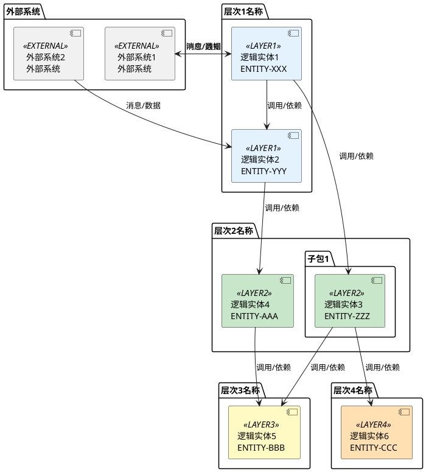

# 逻辑架构

## 架构概述

[系统架构的详细描述，包括：
- 系统的定位和核心职责
- 系统的技术架构特点（如 多线程、事件驱动、微服务等）
- 系统的架构层次划分和每层的职责
- 系统的设计原则和架构风格
]

### 架构层次

系统逻辑架构分为以下主要层次：

1. **[层次1名称]**：[层次1的职责和功能说明]
2. **[层次2名称]**：[层次2的职责和功能说明]
3. **[层次3名称]**：[层次3的职责和功能说明]
4. **[层次4名称]**：[层次4的职责和功能说明]

## 逻辑架构图

[使用PlantUML逻辑实体图描述系统的逻辑架构，包括各层逻辑实体及其关系]

## 架构逻辑实体说明

### 层次1：逻辑实体列表

#### 逻辑实体1
- **实体ID**: ENTITY-XXX
- **逻辑实体职责**: [逻辑实体的核心职责和主要功能]
- **主要接口**: [逻辑实体提供的主要接口或服务]
- **依赖关系**: [逻辑实体依赖的其他逻辑实体或资源]

#### 逻辑实体2
- **实体ID**: ENTITY-YYY
- **逻辑实体职责**: [逻辑实体的核心职责和主要功能]
- **主要接口**: [逻辑实体提供的主要接口或服务]
- **依赖关系**: [逻辑实体依赖的其他逻辑实体或资源]

### 层次2：逻辑实体列表

#### 逻辑实体3
- **实体ID**: ENTITY-ZZZ
- **逻辑实体职责**: [逻辑实体的核心职责和主要功能]
- **主要接口**: [逻辑实体提供的主要接口或服务]
- **依赖关系**: [逻辑实体依赖的其他逻辑实体或资源]

### 层次3：逻辑实体列表

#### 逻辑实体5
- **实体ID**: ENTITY-BBB
- **逻辑实体职责**: [逻辑实体的核心职责和主要功能]
- **主要接口**: [逻辑实体提供的主要接口或服务]
- **依赖关系**: [逻辑实体依赖的其他逻辑实体或资源]

### 层次4：逻辑实体列表

#### 逻辑实体6
- **实体ID**: ENTITY-CCC
- **逻辑实体职责**: [逻辑实体的核心职责和主要功能]
- **主要接口**: [逻辑实体提供的主要接口或服务]
- **依赖关系**: [逻辑实体依赖的其他逻辑实体或资源]

## 数据流向分析

### 1. 业务流程1
- **输入**：[业务流程的输入来源和内容]
- **处理路径**：
  1. [处理步骤1：逻辑实体和操作]
  2. [处理步骤2：逻辑实体和操作]
  3. [处理步骤3：逻辑实体和操作]
  4. [处理步骤4：逻辑实体和操作]
- **输出**：[业务流程的输出内容和去向]

### 2. 业务流程2
- **输入**：[业务流程的输入来源和内容]
- **处理路径**：
  1. [处理步骤1：逻辑实体和操作]
  2. [处理步骤2：逻辑实体和操作]
  3. [处理步骤3：逻辑实体和操作]
- **输出**：[业务流程的输出内容和去向]

### 3. 业务流程3
- **输入**：[业务流程的输入来源和内容]
- **处理路径**：
  1. [处理步骤1：逻辑实体和操作]
  2. [处理步骤2：逻辑实体和操作]
- **输出**：[业务流程的输出内容和去向]

## 核心业务机制说明

### 1. 机制1：生命周期管理
- **[资源类型1管理]**：[描述资源类型1的生命周期管理机制，包括创建、更新、删除等操作]
- **[资源类型2管理]**：[描述资源类型2的生命周期管理机制]
- **[资源类型3管理]**：[描述资源类型3的生命周期管理机制]

### 2. 机制2：消息分发机制
- **[消息类型1分发]**：[描述消息类型1的分发机制，包括分发规则、路由策略等]
- **[消息类型2分发]**：[描述消息类型2的分发机制]
- **[消息类型3分发]**：[描述消息类型3的分发机制]

### 3. 机制3：配置管理机制
- **[配置类型1管理]**：[描述配置类型1的管理机制，包括配置加载、变更通知、热更新等]
- **[配置类型2管理]**：[描述配置类型2的管理机制]
- **[配置变更处理]**：[描述配置变更的处理流程和机制]

### 4. 机制4：错误处理机制
- **[错误类型1处理]**：[描述错误类型1的处理机制，包括错误检测、错误恢复、错误上报等]
- **[错误类型2处理]**：[描述错误类型2的处理机制]
- **[异常恢复机制]**：[描述系统的异常恢复机制]

### 5. 机制5：状态同步机制
- **[状态类型1同步]**：[描述状态类型1的同步机制，包括状态更新、状态查询、状态同步等]
- **[状态类型2同步]**：[描述状态类型2的同步机制]
- **[分布式状态管理]**：[描述分布式环境下的状态管理机制]

### 6. 机制6：性能优化机制
- **[优化策略1]**：[描述性能优化策略1，如 缓存、批量处理、异步处理等]
- **[优化策略2]**：[描述性能优化策略2]
- **[资源管理]**：[描述资源管理策略，如 连接池、线程池、内存管理等]

## 设计原则（可选）

[说明系统的设计原则和架构决策]

- **原则1**: [设计原则1的说明]
- **原则2**: [设计原则2的说明]
- **原则3**: [设计原则3的说明]

## 技术栈（可选）

[列出系统使用的技术栈]

- **通信协议**: [使用的通信协议，如 HTTP/2、UDP/IP、TIPC等]
- **框架/库**: [使用的框架和库，如 DPDK、Spring、gRPC等]
- **数据存储**: [使用的数据存储技术，如 数据库、缓存、消息队列等]
- **开发语言**: [使用的开发语言]

## 扩展性设计（可选）

[说明系统的扩展性设计]

- **水平扩展**: [水平扩展的设计和实现方式]
- **功能扩展**: [功能扩展的设计和实现方式]
- **接口扩展**: [接口扩展的设计和实现方式]

## 约束与限制（可选）

[说明系统的约束和限制]

- [约束1，如 性能限制、资源限制等]
- [约束2]
- [限制1，如 并发限制、容量限制等]
- [限制2]

---

**使用说明：**
- **name**: 逻辑架构文档的标题，通常为 "[系统名称]逻辑架构"
- **version**: 文档版本号，用于版本管理
- **description**: 逻辑架构文档的简要描述（可选字段）
- **文件名格式**: 通常为 `logic_architecture.md`，放在系统规格说明的根目录下
- **内容格式**: 
  - 架构概述部分描述系统的定位、技术特点和架构层次
  - 使用PlantUML逻辑实体图描述系统的逻辑架构
  - 使用 `!define` 定义各层的颜色
  - 使用 `skinparam component` 设置逻辑实体背景色
  - 使用 `package` 组织逻辑实体，可以嵌套
  - 使用 `<<标签>>` 为逻辑实体添加标签，用于颜色分类
  - 使用 `-->` 表示逻辑实体间的依赖关系
  - 架构逻辑实体说明部分详细描述每个逻辑实体的职责和接口
  - 数据流向分析部分描述主要业务流程的数据流向
  - 核心业务机制说明部分描述系统的核心机制和设计模式
  - 设计原则用于说明系统的设计理念（可选）
  - 技术栈用于列出系统使用的技术（可选）
  - 扩展性设计用于说明系统的扩展能力（可选）
  - 约束与限制用于说明系统的限制条件（可选）
