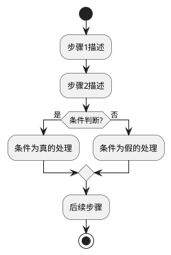
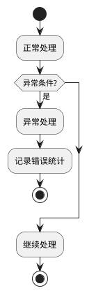

## 功能：[FUNC-XXX-功能名称]

[功能的详细描述，包括业务背景、处理逻辑、输入输出和预期结果]

## 主流程

[使用PlantUML活动图描述功能的主要处理流程]

## 异常流程（可选）

[描述异常情况下的处理流程]

## 关键步骤说明

1. **[步骤1名称]**: [详细说明处理逻辑、校验规则、数据转换等]
2. **[步骤2名称]**: [详细说明处理逻辑、校验规则、数据转换等]
3. **[步骤3名称]**: [详细说明处理逻辑、校验规则、数据转换等]

## 输入输出（可选）

### 输入
- **输入1**: [输入数据的类型、格式、来源等]
- **输入2**: [输入数据的类型、格式、来源等]

### 输出
- **输出1**: [输出数据的类型、格式、去向等]
- **输出2**: [输出数据的类型、格式、去向等]

## 异常场景（可选）

- **异常场景1**: [描述异常情况和处理方式]
- **异常场景2**: [描述异常情况和处理方式]

## 性能要求（可选）

- [性能指标1，如 处理时延、吞吐量等]
- [性能指标2]

## 约束条件（可选）

- [约束1，如 内存限制、线程安全等]
- [约束2]

---

**使用说明：**
- **id**: 功能ID，格式为 `FUNC-XXX`，其中 `XXX` 为三位数字（如 `001`, `002`, `003`...），必须与文件名中的数字保持一致
- **name**: 功能名称，应简洁明了地描述功能的核心内容
- **description**: 功能简要描述，一句话概括功能的核心内容和目的，用于文档索引和快速浏览;功能详细描述，说明功能的业务背景、输入输出、处理逻辑和预期结果（可选字段，用于元模型和文档索引）
- **inputs**: 输入参数或数据，说明功能的输入来源和格式（可选）
- **outputs**: 输出结果或数据，说明功能的输出去向和格式（可选）
- **文件名格式**: `FUNC-XXX-功能名称.md`，其中 `XXX` 为三位数字，与 `id` 中的数字保持一致
- **内容格式**: 
  - 使用PlantUML活动图（Activity Diagram）描述功能处理流程
  - 使用 `|实体名称\nENTITY-XXX|` 标注参与的逻辑实体（实体名称和实体ID分行显示）
  - 使用 `start/stop` 表示流程开始和结束
  - 使用 `if (条件?) then (是)/else (否)/endif` 描述条件分支
  - 使用 `:步骤描述;` 表示处理步骤
  - 关键步骤说明用于补充活动图中难以表达的细节，如校验规则、数据转换逻辑等
  - 异常场景用于描述错误处理和边界情况
  - 输入输出用于明确功能的接口定义
