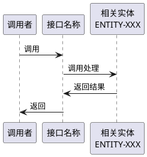

## 接口: [API_XXX-接口名称]

[接口的详细描述，包括业务用途、调用场景、处理逻辑和在系统中的作用]

## 接口定义

[接口的函数签名或入口定义]

```c
[函数签名或接口定义代码]
```

## 接口说明

### 功能描述
[详细说明接口的主要功能和处理逻辑]

### 调用场景
[说明接口在什么场景下被调用，包括：
- 触发条件
- 调用者
- 调用时机
]

### 输入参数
- **参数1**: [参数类型和说明]
- **参数2**: [参数类型和说明]

### 返回值
- **返回值类型**: [返回值说明，包括成功/失败的含义]

### 处理流程
[描述接口的主要处理流程，可以使用文字描述或流程图]

## 代码映射（可选）

[如果接口有对应的实现函数，说明函数名和所在位置]

- **实现函数**: [函数名]
- **所在文件**: [文件路径]
- **调用关系**: [说明函数调用关系]

## 关联关系（可选）

[描述接口与其他接口、功能、场景、实体的关联关系]



## 异常处理（可选）

- **异常情况1**: [描述异常情况和处理方式]
- **异常情况2**: [描述异常情况和处理方式]

---

**使用说明：**
- **id**: 接口ID，格式为 `API-XXX`，其中 `XXX` 为三位数字（如 `001`, `002`, `003`...），必须与文件名中的数字保持一致
- **id**: 接口ID，格式为 `API_XXX`，其中 `XXX` 为三位数字（如 `001`, `002`, `003`...），必须与文件名中的数字保持一致
- **name**: 接口名称，应简洁明了地描述接口的核心功能。建议与文件名后缀一致（即 `API_XXX_后缀.md` 中的“后缀”）
- **file**: 接口所在的源文件路径，用于定位代码实现位置
- **identifier**: 接口的入口标识（已纳入 frontmatter），可以是：
  - CSS通道标识（如 `CSS_FWD_NWDAF_IPV4`）
  - 事件消息标识（如 `EV_MSG_UCOM_NCU_JOB_TO_MCS_REQ`）
  - 服务标识（如 `EV_SERVICE_2_HTTP_PB_REQUEST`）
  - RESTful路径（如 `POST /api/v1/sessions`）
  - 回调函数名
  - 其他系统定义的标识符
- **description**: 接口简要描述，一句话概括接口的核心功能和用途，用于文档索引和快速浏览；接口详细描述，说明接口的业务用途、调用场景和处理逻辑（可选字段，用于元模型和文档索引）
- **文件名格式**: `API_XXX_接口简要总结.md`，其中 `XXX` 为三位数字，与 `id` 中的数字保持一致
- **内容格式**: 
  - 接口定义部分使用代码块展示函数签名或接口定义
  - 接口说明部分详细描述功能、调用场景、输入输出和处理流程
  - 代码映射用于说明接口对应的实现函数（如果接口定义和实现分离）
  - 关联关系用于描述接口与其他元素的协作关系（可选）
  - 异常处理用于描述错误处理和边界情况（可选）
  - 性能要求和约束条件用于说明接口的非功能性要求（可选）
