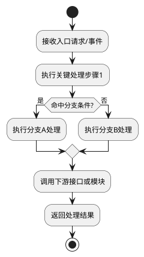

# 功能波及分析：{功能名称}

**功能标识**: {function_key}
**生成时间**: {生成时间}
**波及类型**: {直接/间接}
**来源**: 【来自知识库/代码库的存量功能分析】

---

## 1. 功能概览

### 1.1 功能基本信息

- **功能名称**: {功能名称}
- **功能标识**: {function_key}
- **功能类型**: {功能类型，若未提及则写"未提及"}
- **关联模块**: {模块名称，若未提及则写"未提及"}
- **波及类型**: {直接/间接}

### 1.2 功能描述

{功能描述，若未提及则写"未提及"}

### 1.3 证据摘要

**文档证据来源**:
- {文档路径1} - {片段摘要}
- {文档路径2} - {片段摘要}
- {若未提及则写"未提及"}

**代码证据来源**:
- {文件路径1} - {符号/函数名}
- {文件路径2} - {符号/函数名}
- {若未提及则写"未提及"}

---

## 2. 功能现状分析

### 2.1 关键模块与关系

#### 2.1.1 模块边界

{模块名称} ({模块路径})
- **职责**: {模块职责，若未提及则写"未提及"}
- **依赖模块**: {依赖列表，若未提及则写"未提及"}
- **被依赖模块**: {被依赖列表，若未提及则写"未提及"}

{若未提及则写"未提及"}

#### 2.1.2 模块依赖关系

```
{模块1} → {模块2} → {模块3}
```

{若未提及则写"未提及"}

#### 2.1.3 模块层级归属

- {层级名称} ({路径}) - {层级说明}
- {若未提及则写"未提及"}

### 2.2 业务流程

#### 2.2.1 业务流程步骤

1. {流程步骤1} - {说明}
2. {流程步骤2} - {说明}
3. {流程步骤3} - {说明}

{若未提及则写"未提及"}

#### 2.2.2 流程涉及的关键组件

- {组件1} ({路径/位置}) - {组件说明}
- {组件2} ({路径/位置}) - {组件说明}

{若未提及则写"未提及"}

#### 2.2.3 主处理流程活动图（PlantUML，必填）



{若证据不足则写"证据不足"}

#### 2.2.4 活动图格式校验（避免渲染失败）

- 必须包含且仅包含一个 `@startuml` 与一个 `@enduml`
- 图内禁止 Markdown 表格语法（如 `|---|`）与未闭合代码块
- 活动图建议使用 `start/stop`、`:步骤;`、`if/else/endif` 基本语法
- 若语法不确定，必须先退化为最小可渲染骨架再补充步骤

### 2.3 入口分析

#### 2.3.1 接口入口

| 接口路径/方法 | 接口类型 | 参数 | 返回值 | 说明 | 证据来源 |
|--------------|---------|------|--------|------|---------|
| {接口路径1} | {HTTP/CLI/消息等} | {参数描述} | {返回值描述} | {接口说明} | {文档路径/代码路径} |
| {接口路径2} | {HTTP/CLI/消息等} | {参数描述} | {返回值描述} | {接口说明} | {文档路径/代码路径} |

{若未提及则写"未提及"}

#### 2.3.2 函数处理入口

- {函数名1} ({文件路径}:{行号}) - {函数说明}
- {函数名2} ({文件路径}:{行号}) - {函数说明}

{若未提及则写"未提及"}

#### 2.3.3 模块层级入口

- {层级名称} ({路径}) - {层级说明}
- {若未提及则写"未提及"}

### 2.4 关联接口（引用）

| 接口标识 | 接口名称 | 关系类型 | 对应接口函数 | 参数摘要 | 接口文档 |
|---------|---------|---------|-------------|---------|---------|
| {interface_key1} | {接口名称1} | {entry/invoke/callback/query/event_binding} | {函数名/符号} | {关键参数摘要} | [查看接口文档](../interfaces/{interface_key1}.md) |
| {interface_key2} | {接口名称2} | {entry/invoke/callback/query/event_binding} | {函数名/符号} | {关键参数摘要} | [查看接口文档](../interfaces/{interface_key2}.md) |

{若未提及则写"未提及"}

### 2.5 接口-代码波及链路（修改点串联）

| 序号 | 接口标识 | relation_type | 波及代码文件 | 波及函数/符号 | 修改点类型（增/删/改/查） | 证据来源 |
|-----|---------|--------------|-------------|--------------|--------------------------|---------|
| 1 | {interface_key1} | {entry/invoke/callback/query/event_binding} | {file_path1} | {symbol1} | {改} | {代码路径/文档路径} |
| 2 | {interface_key2} | {entry/invoke/callback/query/event_binding} | {file_path2} | {symbol2} | {查} | {代码路径/文档路径} |

{若未提及则写"未提及"}

---

## 3. 波及点候选分析

### 3.1 增类波及点

**候选位置**:
- {位置1} ({文件路径}:{行号范围}) - {说明} - 证据: {证据来源}
- {位置2} ({文件路径}:{行号范围}) - {说明} - 证据: {证据来源}

{若未提及则写"未提及"}

**扩展点/分支/配置点**:
- {扩展点1} ({文件路径}:{行号范围}) - {说明}
- {扩展点2} ({文件路径}:{行号范围}) - {说明}

{若未提及则写"未提及"}

### 3.2 删类波及点

**候选位置**:
- {位置1} ({文件路径}:{行号范围}) - {说明} - 证据: {证据来源}
- {位置2} ({文件路径}:{行号范围}) - {说明} - 证据: {证据来源}

{若未提及则写"未提及"}

**注意**: 仅在需求明确且存量存在对应项时列出候选

### 3.3 改类波及点

**流程节点候选**:
- {节点1} ({文件路径}:{行号范围}) - {说明} - 证据: {证据来源}
- {节点2} ({文件路径}:{行号范围}) - {说明} - 证据: {证据来源}

{若未提及则写"未提及"}

**校验规则候选**:
- {规则1} ({文件路径}:{行号范围}) - {说明} - 证据: {证据来源}
- {规则2} ({文件路径}:{行号范围}) - {说明} - 证据: {证据来源}

{若未提及则写"未提及"}

**数据结构候选**:
- {结构1} ({文件路径}:{行号范围}) - {说明} - 证据: {证据来源}
- {结构2} ({文件路径}:{行号范围}) - {说明} - 证据: {证据来源}

{若未提及则写"未提及"}

**接口契约候选**:
- {接口1} ({文件路径}:{行号范围}) - {说明} - 证据: {证据来源}
- {接口2} ({文件路径}:{行号范围}) - {说明} - 证据: {证据来源}

{若未提及则写"未提及"}

### 3.4 查类波及点

**查询路径候选**:
- {路径1} ({文件路径}:{行号范围}) - {说明} - 证据: {证据来源}
- {路径2} ({文件路径}:{行号范围}) - {说明} - 证据: {证据来源}

{若未提及则写"未提及"}

**读模型候选**:
- {模型1} ({文件路径}:{行号范围}) - {说明} - 证据: {证据来源}
- {模型2} ({文件路径}:{行号范围}) - {说明} - 证据: {证据来源}

{若未提及则写"未提及"}

**缓存/索引候选**:
- {缓存1} ({文件路径}:{行号范围}) - {说明} - 证据: {证据来源}
- {索引1} ({文件路径}:{行号范围}) - {说明} - 证据: {证据来源}

{若未提及则写"未提及"}

---

## 4. 证据与定位

### 4.1 文档证据

| 文档路径 | 片段摘要/章节 | 引用内容 |
|---------|--------------|---------|
| {文档路径1} | {章节/片段位置} | {引用内容摘要} |
| {文档路径2} | {章节/片段位置} | {引用内容摘要} |

{若未提及则写"未提及"}

### 4.2 代码证据

| 文件路径 | 符号/函数名 | 行号范围 | 说明 |
|---------|------------|---------|------|
| {文件路径1} | {符号/函数名1} | {行号范围} | {说明} |
| {文件路径2} | {符号/函数名2} | {行号范围} | {说明} |

{若未提及则写"未提及"}

### 4.3 无法定位项

| 项名称 | 原因说明 |
|-------|---------|
| {项名称1} | {原因说明} |
| {项名称2} | {原因说明} |

{若未提及则写"无"}

---

## 5. 缺失项与风险提示

### 5.1 证据不足项

| 项名称 | 原因说明 |
|-------|---------|
| {项名称1} | {原因说明} |
| {项名称2} | {原因说明} |

{若未提及则写"无"}

### 5.2 风险提示

**已知风险点**:
- {风险点1} - {说明}
- {风险点2} - {说明}

{若未提及则写"无"}

**注意事项**:
- {注意点1} - {说明}
- {注意点2} - {说明}

{若未提及则写"无"}

---

## 6. 波及入口汇总

### 6.1 波及模块

- {模块名称1} ({模块路径1})
- {模块名称2} ({模块路径2})

{若未提及则写"未提及"}

### 6.2 波及文件

- {文件路径1} - {文件说明}
- {文件路径2} - {文件说明}

{若未提及则写"未提及"}

### 6.3 波及函数

- {函数名1} ({文件路径}:{行号范围}) - {函数说明}
- {函数名2} ({文件路径}:{行号范围}) - {函数说明}

{若未提及则写"未提及"}

---

## 7. 附录

### 7.1 缓存文件追溯

本文档各章节可追溯到以下缓存文件：

- **功能现状分析**: `{FEATURE_DIR}/on-demand/stage3/{function_key}/current-state.json`
- **业务流程**: `{FEATURE_DIR}/on-demand/stage3/{function_key}/business-flow.md`
- **入口分析**: `{FEATURE_DIR}/on-demand/stage3/{function_key}/entrypoints.json`
- **波及点候选**: `{FEATURE_DIR}/on-demand/stage3/{function_key}/impact-points.json`
- **证据汇总**: `{FEATURE_DIR}/on-demand/stage3/{function_key}/evidence.json`

### 7.2 相关链接

- [返回总览文档](../on-demand-existing-function-analysis-{BRANCH_NAME}.md)（其中 `BRANCH_NAME` 为从 `feature_dir` 提取的分支标识，在生成文档时需要替换为实际值）

---

**注意**:
- 本文档仅描述"what exists"（存量事实），不包含新需求推断
- 所有结论必须可回溯到文档或代码证据
- 缺失信息统一标记为"未提及"或"证据不足"
- 不得推断补全未在证据中明确提及的内容
- 各章节内容必须可追溯到对应的缓存文件