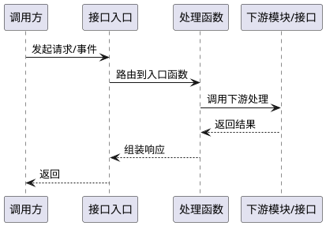

# 接口波及分析：{接口名称}

**接口标识**: {interface_key}
**接口类型**: {HTTP/消息/CLI/任务/其他}
**生成时间**: {生成时间}
**来源**: 【来自知识库/代码库的存量接口分析】

---

## 1. 接口概览

### 1.1 基本信息

- **接口名称**: {接口名称}
- **接口标识**: {interface_key}
- **接口类型**: {接口类型}
- **关联模块**: {模块名称，若未提及则写"未提及"}

### 1.2 接口定义

- **协议**: {HTTP/消息/CLI/其他}
- **接口路径/主题/命令**: {接口定义，若未提及则写"未提及"}
- **方法/操作**: {GET/POST/订阅/发布/命令等，若未提及则写"未提及"}

### 1.3 接口描述

{接口用途、调用场景和边界说明，若未提及则写"未提及"}

---

## 2. 参数说明

### 2.1 请求参数

| 参数名 | 位置 | 类型 | 必填 | 说明 | 证据来源 |
|-------|------|------|------|------|---------|
| {param1} | {path/query/body/header} | {type} | {Y/N} | {说明} | {代码/文档路径} |
| {param2} | {path/query/body/header} | {type} | {Y/N} | {说明} | {代码/文档路径} |

{若未提及则写"未提及"}

### 2.2 返回参数

| 字段名 | 类型 | 说明 | 证据来源 |
|-------|------|------|---------|
| {field1} | {type} | {说明} | {代码/文档路径} |
| {field2} | {type} | {说明} | {代码/文档路径} |

{若未提及则写"未提及"}

---

## 3. 对应接口函数

| 层级 | 函数/符号 | 文件路径 | 行范围 | 说明 |
|------|----------|---------|-------|------|
| {controller/handler} | {symbol1} | {file_path1} | {range1} | {说明} |
| {service/usecase} | {symbol2} | {file_path2} | {range2} | {说明} |

{若未提及则写"未提及"}

---

## 4. 接口使用流程图（PlantUML，必填）

{若证据不足则写"证据不足"}

---

## 5. 关联功能（反向引用）

| 功能标识 | 功能名称 | 关系类型 | 功能文档 |
|---------|---------|---------|---------|
| {function_key1} | {功能名称1} | {entry/invoke/callback/query/event_binding} | [查看功能文档](../functions/{function_key1}.md) |
| {function_key2} | {功能名称2} | {entry/invoke/callback/query/event_binding} | [查看功能文档](../functions/{function_key2}.md) |

{若未提及则写"未提及"}

---

## 6. 证据与定位

### 5.1 文档证据

| 文档路径 | 片段摘要 |
|---------|---------|
| {doc_path1} | {摘要1} |
| {doc_path2} | {摘要2} |

{若未提及则写"未提及"}

### 5.2 代码证据

| 文件路径 | 符号/函数名 | 行号范围 | 说明 |
|---------|------------|---------|------|
| {code_path1} | {symbol1} | {range1} | {说明1} |
| {code_path2} | {symbol2} | {range2} | {说明2} |

{若未提及则写"未提及"}

---

**注意**:
- 本文档仅描述"what exists"（存量事实），不包含新需求推断。
- 所有结论必须可回溯到文档或代码证据。
- 缺失信息统一标记为"未提及"或"证据不足"。
