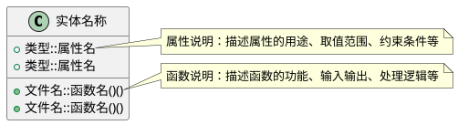

## 实体: [ENTITY-XXX-实体名称]

[实体的详细描述，包括业务职责、主要功能、设计意图和在整个系统中的作用]

## 实体结构

[使用PlantUML类图描述实体的结构，包括属性和方法]

## 属性说明

### 属性1
- **类型**: [数据类型，如 结构体类型、基本类型等]
- **用途**: [属性的业务用途]
- **取值范围**: [可选，如 枚举值、数值范围等]
- **约束条件**: [可选，如 非空、唯一性等]

### 属性2
- **类型**: [数据类型]
- **用途**: [属性的业务用途]
- **取值范围**: [可选]
- **约束条件**: [可选]

## 方法说明

### 方法1
- **函数签名**: [完整的函数签名，包括参数和返回值]
- **功能描述**: [方法的主要功能和处理逻辑]
- **输入参数**: [参数说明]
- **返回值**: [返回值说明]
- **调用场景**: [方法被调用的场景和上下文]

### 方法2
- **函数签名**: [完整的函数签名]
- **功能描述**: [方法的主要功能和处理逻辑]
- **输入参数**: [参数说明]
- **返回值**: [返回值说明]
- **调用场景**: [方法被调用的场景和上下文]

## 职责说明

[详细说明实体的核心职责，包括：
- 主要处理哪些业务逻辑
- 与其他实体的交互关系
- 在系统中的定位和作用
]

---

**使用说明：**
- **id**: 实体ID，格式为 `ENTITY-XXX`，其中 `XXX` 为三位数字（如 `001`, `002`, `003`...），必须与文件名中的数字保持一致
- **name**: 实体名称，应简洁明了地描述实体的核心职责
- **description**: 实体简要描述，一句话概括实体的核心职责和功能，用于文档索引和快速浏览；实体详细描述，说明实体的业务职责、主要功能和设计意图（可选字段，用于元模型和文档索引）
- **文件名格式**: `ENTITY-XXX-实体名称.md`，其中 `XXX` 为三位数字，与 `id` 中的数字保持一致
- **内容格式**: 
  - 使用PlantUML类图（Class Diagram）描述实体的结构
  - 类中包含属性和方法，使用 `+` 表示公共成员
  - 属性格式：`类型::属性名`，其中类型可以是结构体类型、基本类型等
  - 方法格式：`文件名::函数名()()`，其中第一个括号表示参数，第二个括号表示返回值
  - 使用 `note right of 实体名称::成员名` 为属性和方法添加说明
  - 属性说明部分详细描述每个属性的类型、用途、取值范围和约束条件
  - 方法说明部分详细描述每个方法的功能、输入输出和调用场景
  - 职责说明用于阐述实体在整个系统中的定位和作用
  - 交互关系用于描述实体与其他实体的协作关系（可选）
  - 设计约束用于说明实体的实现约束和限制（可选）

