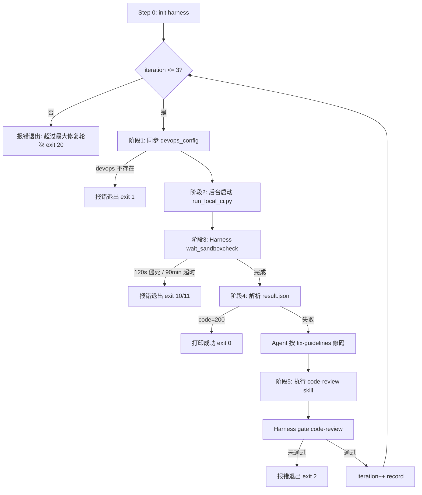
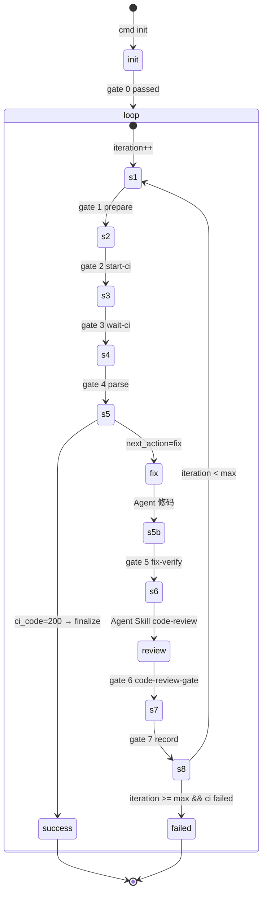

# local-sandbox-fix Skill 方案设计

> 版本：1.2.0  
> 状态：设计稿（待实现）  
> 关联技能：`local-sandboxcheck`、`code-review`  
> 变更：v1.2 — 工程路径统一为 `CLAUDE_WORKING_DIR`（对齐 design 环境初始化）

---

## 1. 概述

### 1.1 技能定位

| 维度 | 说明 |
|------|------|
| **技能名** | `local-sandbox-fix` |
| **职责** | 编排「本地沙盒 CI → 失败分析 → Agent 修码 → code-review → 重测」闭环 |
| **依赖** | `local-sandboxcheck`（执行检查）、`code-review`（修码后审查） |
| **不负责** | 外部引擎配置渲染、REST API 轮询（仍由 `run_local_ci.py` 内部完成） |

### 1.2 与 local-sandboxcheck 的分工

```
local-sandboxcheck  →  单次检查 + 产出 result.json
local-sandbox-fix     →  多轮编排 + 自动修复 + Harness 门禁守护
```

### 1.3 使用场景

- 提交 / `git review` 前，自动跑本地 CI 并在失败时尝试修复
- Agent 驱动的「检查—修复—审查—重测」闭环，最多 3 轮

### 1.4 触发词

`local-sandbox-fix`、本地沙盒修复、sandbox 自动修复

---

## 2. 需求映射

| 编号 | 需求 | 方案对应 |
|------|------|----------|
| 3.1 | 检查 `${CLAUDE_WORKING_DIR}/devops_config.yaml`：存在则 cp 到 local-sandboxcheck；**缺失则视为可选配置，skip 后续并以 success 结束**（不退出/不报错） | gate `1-prepare-config` |
| 3.2 | 调用 `run_local_ci.py <工程路径>` | `run_local_ci.py "${CLAUDE_WORKING_DIR}"`（gate 2） |
| 3.3 | 轮询 `run.log` / `result.json`；120s 无更新或 90min 无 result 则报错 | `wait_sandboxcheck.py` + Harness gate step 3 |
| 3.4 | 解析 `result.json`，成功则结束，失败则修码 | 阶段 4 + Agent + Harness gate step 4 |
| 3.5 | 修码后执行 `code-review` skill | 阶段 5 + Harness gate step 5 |
| 3.6 | 再次检查，最多循环 3 次 | 阶段 6 + manifest iteration 控制 |
| 4.1 | Skill 编写规范、简洁清晰 | SKILL.md 编排 + references 分阶段 |
| 4.2 | SKILL.md 控流程，references 分阶段，scripts 放脚本 | 见 §3 目录结构 |
| 4.3 | Harness 守护运行，尤其 3.3、3.5 | 见 §6 Harness 设计 |
| 4.4 | 文件操作使用绝对路径 | 见 §4 路径约定 |

---

## 3. 目录结构

```
skills/local-sandbox-fix/
├── SKILL.md                              # 总编排入口（Agent 只读此文件驱动流程）
├── docs/
│   └── local-sandbox-fix-design.md           # 本文档
├── references/
│   ├── harness-contract.json             # Harness 机读契约（超时、路径、成功判定）
│   ├── fix-guidelines.md                 # 修码约束（禁止删文件规避、日志分析优先级）
│   └── stages/
│       ├── 01-prepare-config.md          # 阶段1：devops_config 同步
│       ├── 02-run-and-wait-ci.md         # 阶段2：触发 CI + Harness 等待
│       ├── 03-analyze-result-and-fix.md  # 阶段3：解析结果 + Agent 修码
│       ├── 04-code-review-gate.md        # 阶段4：code-review + Harness 验收
│       └── 05-retry-and-exit.md          # 阶段5：循环控制与退出
└── scripts/
    ├── python/
    │   ├── local_sandbox_fix_harness.py      # Harness 核心（init / gate / record / resume）
    │   └── wait_sandboxcheck.py          # 3.3 专用：轮询 run.log / result.json
    └── bash/
        ├── local-sandbox-fix-common.sh       # 绝对路径常量
        ├── local-sandbox-fix-init-harness.sh
        └── local-sandbox-fix-gate.sh
```

---

## 4. 环境变量与绝对路径约定

本技能**所有**路径拼接、Git 操作、`run_local_ci.py` 的 `<工程路径>` 参数，均依赖 `CLAUDE_WORKING_DIR`（对齐 `skills/design/SKILL.md` 环境初始化，**禁止**用 `git rev-parse --show-toplevel` 推断工程根）。

### 4.1 环境变量

| 变量 | 含义 | 解析规则 |
|------|------|----------|
| `CLAUDE_PLUGIN_ROOT` | Omni 插件根 | 必须存在 `${CLAUDE_PLUGIN_ROOT}/skills/local-sandbox-fix/SKILL.md` |
| `CLAUDE_WORKING_DIR` | **工程路径 / 用户工作区**（可为 Git 仓库子目录） | 即 `run_local_ci.py` 的 workdir；devops_config 所在根 |
| `FEATURE_DIR` | 特性目录（自动解析） | init 自动从记录文件解析（`.active-feature` / `changes/*/.runs/.omnispec-state.json` / 环境变量），可显式 `--feature-dir` 覆盖；解析不到则报错。harness 产物落盘根（`${FEATURE_DIR}/.runs/local-sandbox-fix`）；用于 code-review 报告落盘 |

> **无 `PROJECT_ROOT` 变量**：文档与脚本中统一使用 `CLAUDE_WORKING_DIR` 表示工程路径，避免与 `working_dir` 双名混用。

### 4.2 环境初始化（对齐 design Step 0）

**Step 0.1 — 检查变量**

```bash
test -n "${CLAUDE_PLUGIN_ROOT:-}" && test -d "${CLAUDE_PLUGIN_ROOT}"
test -n "${CLAUDE_WORKING_DIR:-}" && test -d "${CLAUDE_WORKING_DIR}"
```

**Step 0.2 — 补全（仅 Agent 层一次）**

```bash
# CLAUDE_WORKING_DIR 缺失时：
export CLAUDE_WORKING_DIR="$(pwd)"
# 禁止：git rev-parse --show-toplevel
```

**Step 0.3 — 校验脚本存在**

```bash
test -f "${CLAUDE_PLUGIN_ROOT}/skills/local-sandbox-fix/scripts/python/local_sandbox_fix_harness.py"
test -f "${CLAUDE_PLUGIN_ROOT}/skills/local-sandbox-fix/scripts/bash/local-sandbox-fix-init-harness.sh"
test -d "${CLAUDE_WORKING_DIR}"
```

**Step 0.4 — 解析 FEATURE_DIR（自动从记录文件获取）**

FEATURE_DIR 由 harness `init` 自动解析（harness 产物落 `${FEATURE_DIR}/.runs/local-sandbox-fix`）。未传 `--feature-dir` 时，harness 调 `omnispec_state.resolve_feature_dir()`，优先级：显式参数 > 环境变量 > `.active-feature` > 最新 `changes/*/.runs/.omnispec-state.json` > prerequisites。也可沿用 design 的解析器（结果一致）：

```bash
eval "$(bash "${CLAUDE_PLUGIN_ROOT}/skills/design/scripts/bash/design-resolve-context.sh" \
  --plugin-root "${CLAUDE_PLUGIN_ROOT}" \
  --working-dir "${CLAUDE_WORKING_DIR}" \
  ${FEATURE_DIR:+--feature-dir "$FEATURE_DIR"} \
  --export)" 2>/dev/null || true
[[ -f "${FEATURE_DIR}/.runs/env.sh" ]] && source "${FEATURE_DIR}/.runs/env.sh"
```

解析不到时 init 直接报错（`FEATURE_DIR 无法从记录文件解析`），不进入主循环。code-review 报告仍优先 `${FEATURE_DIR}`，`${CLAUDE_WORKING_DIR}` 仅作兜底候选。

### 4.3 固定绝对路径（Harness init 写入 paths.json）

| 键名 | 路径模式 |
|------|----------|
| `plugin_root` | `${CLAUDE_PLUGIN_ROOT}` |
| `working_dir` | `${CLAUDE_WORKING_DIR}` |
| `feature_dir` | `${FEATURE_DIR}`（init 自动解析，可 `--feature-dir` 覆盖） |
| `sandboxcheck_dir` | `${CLAUDE_PLUGIN_ROOT}/skills/local-sandboxcheck` |
| `devops_src` | `${CLAUDE_WORKING_DIR}/devops_config.yaml` |
| `devops_dst` | `${sandboxcheck_dir}/assets/input_biz_config/devops_config.yaml` |
| `run_ci_script` | `${sandboxcheck_dir}/scripts/run_local_ci.py` |
| `execution_outputs` | `${sandboxcheck_dir}/execution_outputs` |
| `run_log` | `${execution_outputs}/run.log` |
| `result_json` | `${execution_outputs}/result.json` |
| `harness_dir` | `${FEATURE_DIR}/.runs/local-sandbox-fix` |

### 4.4 paths.json 示例

```json
{
  "plugin_root": "/abs/path/OmniSpec2",
  "working_dir": "/abs/path/OmniSpec2",
  "feature_dir": "/abs/path/OmniSpec2/changes/001-feature",
  "sandboxcheck_dir": "/abs/path/OmniSpec2/skills/local-sandboxcheck",
  "devops_src": "/abs/path/OmniSpec2/devops_config.yaml",
  "devops_dst": "/abs/path/OmniSpec2/skills/local-sandboxcheck/assets/input_biz_config/devops_config.yaml",
  "run_ci_script": "/abs/path/OmniSpec2/skills/local-sandboxcheck/scripts/run_local_ci.py",
  "execution_outputs": "/abs/path/OmniSpec2/skills/local-sandboxcheck/execution_outputs",
  "run_log": "/abs/path/OmniSpec2/skills/local-sandboxcheck/execution_outputs/run.log",
  "result_json": "/abs/path/OmniSpec2/skills/local-sandboxcheck/execution_outputs/result.json",
  "harness_dir": "/abs/path/OmniSpec2/changes/001-feature/.runs/local-sandbox-fix",
  "max_iterations": 3,
  "stale_timeout_sec": 120,
  "global_timeout_sec": 5400
}
```

### 4.5 env.sh 导出（init 写入）

```bash
export CLAUDE_PLUGIN_ROOT="/abs/path/OmniSpec2"
export CLAUDE_WORKING_DIR="/abs/path/OmniSpec2"
export FEATURE_DIR="/abs/path/OmniSpec2/changes/001-feature"
export HARNESS_DIR="/abs/path/OmniSpec2/changes/001-feature/.runs/local-sandbox-fix"
export DEVOPS_SRC="/abs/path/OmniSpec2/devops_config.yaml"
export DEVOPS_DST="/abs/path/.../local-sandboxcheck/assets/input_biz_config/devops_config.yaml"
export RUN_CI_SCRIPT="/abs/path/.../local-sandboxcheck/scripts/run_local_ci.py"
export RUN_LOG="/abs/path/.../execution_outputs/run.log"
export RESULT_JSON="/abs/path/.../execution_outputs/result.json"
```

### 4.6 路径规则

- 所有 `Path` 在 Python 中使用 `.resolve()` 绝对化
- Harness init **必须**传 `--plugin-root`、`--working-dir`；`--feature-dir` 可选（不传则 harness 自动从记录文件解析 FEATURE_DIR，harness 产物落 `${FEATURE_DIR}/.runs/local-sandbox-fix`）
- **禁止**脚本内用 `__file__.parents`、`pwd`、`git rev-parse` 推断 `working_dir`
- Agent 执行 shell 前：`source "${HARNESS_DIR}/env.sh"`
- Git 操作统一：`git -C "${CLAUDE_WORKING_DIR}" ...`

---

## 5. 整体流程



### 5.1 单轮步骤顺序

> **变更（v1.2）**：原 gate `1-prepare-config`（cp devops_config + 缺失 skip）已**并入 gate `0-init`**（init 只建地基，gate 0-init 做就绪校验 + 文件初始化），主循环不再含该 step，首步为 `2-start-ci`。下文及 §6.11 伪代码、§7.2、§6.12 契约中凡提及 `1-prepare-config` 的，均视为已迁移至 gate 0-init（`_prepare_devops_config` / `_skip_devops_missing`）。运行真值以 [SKILL.md](../SKILL.md) 与 [harness-contract.json](../references/harness-contract.json) 为准。

每轮（iteration）严格按序执行，**Harness gate_exit≠0 时不得进入下一步**：

| 序号 | step id | 执行者 | 说明 |
|------|---------|--------|------|
| 0 | init（`0-init`） | **Harness init**（内含 cp） | 同步 devops_config（缺失则 skip 成功结束，不进主循环） |
| 1 | `2-start-ci` | **Harness gate**（内含 nohup） | 后台启动 run_local_ci.py |
| 2 | `3-wait-ci` | **Harness gate**（阻塞调用 wait 脚本） | 守护等待 3.3 |
| 3 | `4-parse-result` | **Harness gate** | 解析 result.json，写 fix-context |
| — | `agent-fix` | **Agent**（仅 step4 指示 fix 时） | 读 fix-context 修码 |
| 4 | `5-fix-verify` | **Harness gate** | 验证修码后 git diff 存在 |
| — | `agent-code-review` | **Agent**（Skill 工具） | `Skill("code-review")` |
| 5 | `6-code-review-gate` | **Harness gate** | 验收审查报告 3.5 |
| 6 | `7-record-iteration` | **Harness record** | iteration++，重置下轮 step 或 finalize/exit |

### 5.2 Agent 与 Harness 职责分界

| 职责 | 执行者 | 原因 |
|------|--------|------|
| cp 配置、启动 CI、轮询日志、解析 JSON、验 git diff、验 review 报告 | **Harness 脚本** | 可机读、可重复、可超时守护 |
| 读日志分析根因、修改源代码 | **Agent** | 需 LLM 推理 |
| 执行 code-review | **Agent 通过 Skill 工具** | `code-review` 自带 `context: fork` |
| 循环计数、断点续跑、步骤状态 | **Harness manifest** | 防止 Agent 跳步或漏步 |

---

## 6. Harness 详细设计（核心）

### 6.1 设计原则

参照 `specify_harness.py`、`reverse_on_demand_harness.py`：

1. **机械步骤尽量内聚在 gate 内**（cp、nohup、wait），Agent 只负责 gate 之间的 LLM 工作
2. **gate  stdout 统一 JSON**，含 `gate_exit`、`next_action`、`errors`，Agent 只读 JSON 决策
3. **`--record` 强制落盘** 到 `run-manifest.json`，resume 只信 manifest，不信 Agent 记忆
4. **长时间阻塞只在 gate step 3** 内发生；Agent 不得手工 tail/run.log
5. code-review 使用 `Skill("code-review")` 同步等待

### 6.2 状态机



**phase 字段（run-manifest.json）：**

| phase | 含义 |
|-------|------|
| `init` | 刚 init，尚未进入循环 |
| `loop` | 循环中 |
| `success` | CI 通过，已 finalize |
| `failed` | 超限或不可恢复错误 |

### 6.3 落盘文件一览

```
${HARNESS_DIR}/
├── paths.json                 # 全部绝对路径（init 写入，不可改）
├── env.sh                     # source 用 export（init 写入）
├── run-manifest.json          # 状态机 + 各 step 门禁记录（核心）
├── run_local_ci.pid           # 当前轮 CI 进程 PID（gate 2 写入）
├── ci-session.json            # 当前轮 CI 会话边界（gate 2 写入，wait 使用）
├── fix-context.json           # gate 4 失败时写入
├── summary.json               # finalize 写入
├── steps/                     # 每步 gate 详细结果（--record 时）
│   └── iter-{N}-{step-id}.json
└── history/                   # 每轮归档摘要
    └── iter-{N}-summary.json
```

### 6.4 run-manifest.json 完整 Schema

```json
{
  "schema_version": "1",
  "run_id": "uuid",
  "phase": "loop",
  "iteration": 1,
  "max_iterations": 3,
  "current_step": "3-wait-ci",
  "status": "running",
  "started_at": "2026-06-11T10:00:00+08:00",
  "updated_at": "2026-06-11T10:05:00+08:00",
  "last_ci_code": null,
  "last_ci_id": null,
  "fix_started_at": null,
  "review_started_at": null,
  "gates": {
    "0-init": {
      "status": "passed",
      "gate_exit": 0,
      "updated_at": "...",
      "notes": "ok"
    },
    "1-prepare-config": {
      "status": "passed",
      "gate_exit": 0,
      "iteration": 1,
      "artifact": "/abs/.../steps/iter-1-1-prepare-config.json"
    },
    "2-start-ci": { "status": "pending", "gate_exit": null, "iteration": 1 },
    "3-wait-ci": { "status": "pending", "gate_exit": null, "iteration": 1 },
    "4-parse-result": { "status": "pending", "gate_exit": null, "iteration": 1 },
    "5-fix-verify": { "status": "pending", "gate_exit": null, "iteration": 1 },
    "6-code-review-gate": { "status": "pending", "gate_exit": null, "iteration": 1 },
    "7-record-iteration": { "status": "pending", "gate_exit": null, "iteration": 1 }
  },
  "history": [
    {
      "iteration": 1,
      "ci_code": 10300,
      "ci_id": "abc-123",
      "failed_checks": ["BUILD", "UT"],
      "fixed": true,
      "review_passed": true,
      "ended_at": "..."
    }
  ]
}
```

**gate status 枚举：** `pending` | `passed` | `failed` | `skipped`

### 6.5 GATE_STEPS 有序列表

```python
GATE_STEPS = [
    "0-init",
    "1-prepare-config",
    "2-start-ci",
    "3-wait-ci",
    "4-parse-result",
    "5-fix-verify",
    "6-code-review-gate",
    "7-record-iteration",
]
```

每轮 iteration 开始时，步骤 `1`～`7` 的 `gates[step].status` 重置为 `pending`（`0-init` 不重置）。

### 6.6 子命令规格

| 子命令 | 功能 | exit 0 条件 |
|--------|------|-------------|
| `init` | 写 paths/env/manifest；创建 steps/、history/ | 目录与三文件创建成功 |
| `gate --step STEP [--record]` | 执行单步（含机械动作 + 校验） | gate_exit=0 |
| `resume` | 读 manifest，输出 pending | 总是 0（信息性） |
| `record --step 7-record-iteration` | iteration++，归档本轮，重置下轮 gates | 未超 max 或 CI 已通过 |
| `finalize` | phase=success，写 summary.json | CI code=200 |
| `abort --reason TEXT` | phase=failed，写 summary | 用于超时等 |

**gate  stdout 统一格式：**

```json
{
  "harness_dir": "/abs/.../.runs/local-sandbox-fix",
  "step": "4-parse-result",
  "iteration": 1,
  "gate_exit": 0,
  "errors": [],
  "next_action": "fix",
  "ci_code": 10300,
  "ci_id": "sandbox-ci-xxx",
  "fix_context": "/abs/.../fix-context.json",
  "artifact": "/abs/.../steps/iter-1-4-parse-result.json"
}
```

**next_action 枚举：**

| 值 | 含义 | Agent 下一步 |
|----|------|--------------|
| `continue` | 本步通过，进入 manifest 中下一 pending step | 执行下一 gate |
| `fix` | CI 失败，fix-context 已写好 | 读 fix-context 修码 → gate 5 |
| `code-review` | fix-verify 通过 | `Skill("code-review")` → gate 6 |
| `next_iteration` | record 完成且需重测 | gate 1（新 iteration） |
| `finalize` | CI 通过 | 调用 finalize，结束 |
| `abort` | 不可继续 | 打印 errors，exit 非 0 |

### 6.7 逐步 gate 实现规格

#### gate `0-init`

- **前置：** `--plugin-root`、`--working-dir` 目录存在（init 参数与 design 一致）
- **动作：**
  1. `working_dir = Path(args.working_dir).resolve()`
  2. 写 paths.json（含 `working_dir`）、env.sh、run-manifest.json（phase=init）
- **校验：** paths 中 `plugin_root`、`working_dir`、`run_ci_script` 等为绝对路径且存在（run_ci_script 必须 isfile）
- **record：** gates.`0-init`.status=passed

#### gate `1-prepare-config`

- **前置：** iteration 已 ≥1（由 record 或 init 后首次 `begin-iteration` 设置）
- **动作（Harness 内执行，Agent 不手工 cp）：**
  ```python
  if not devops_src.is_file():
      return [], "skip"          # 可选配置：缺失不报错
  else:
      shutil.copy2(devops_src, devops_dst)
  ```
- **缺失语义：** devops_config.yaml 视为可选。缺失时 `next_action=skip`，由 cmd_gate 将后续 gate 标记为 `skipped` 并直接 `cmd_finalize`（`status=success`, `skipped=true`），不跑 CI、不修码、不询问用户。
- **校验：**
  - devops_src 存在
  - devops_dst 存在
  - devops_dst.stat().st_mtime >= devops_src.stat().st_mtime
- **失败 exit：** gate_exit=1（配置缺失）
- **next_action：** `continue`

#### gate `2-start-ci`

- **动作（Harness 内执行）：**
  1. 读 run.log 当前 size 作为 session 起点，写入 `ci-session.json`：
     ```json
     {
       "iteration": 1,
       "run_log_path": "/abs/.../run.log",
       "run_log_offset": 12345,
       "run_log_mtime_before": 1718070000.0,
       "started_at": "2026-06-11T10:01:00+08:00"
     }
     ```
  2. 若存在旧 PID 且进程仍存活 → errors（防止重复启动）
  3. `subprocess.Popen([python3.8, run_ci_script, working_dir], ...)` 后台启动
     - 其中 `working_dir` 取自 paths.json 的 `working_dir`（= `CLAUDE_WORKING_DIR`）
  4. 写 `run_local_ci.pid`
- **校验（启动后等待最多 30s，每 2s 重试）：**
  - PID 文件存在
  - 进程存活 **或** run.log 出现新一轮 `=== 执行开始 ===` 且 offset > session.run_log_offset
- **next_action：** `continue`

> **多轮关键：** wait 脚本只检查 **ci-session.run_log_offset 之后** 的内容，避免误判上一轮 marker。

#### gate `3-wait-ci`（阻塞，Agent 禁止替代）

- **动作：** 同步调用 wait_sandboxcheck.py（见 §6.8），最长阻塞 90min
- **参数：**
  ```bash
  python3 wait_sandboxcheck.py \
    --run-log "${RUN_LOG}" \
    --result-json "${RESULT_JSON}" \
    --session-file "${HARNESS_DIR}/ci-session.json" \
    --pid-file "${HARNESS_DIR}/run_local_ci.pid" \
    --stale-timeout 120 \
    --global-timeout 5400 \
    --poll-interval 5
  ```
- **校验：** wait 脚本 exit 0
- **失败 propagate：** 10/11/12 原样作为 process exit code
- **next_action：** `continue`

#### gate `4-parse-result`

- **动作：**
  1. 读 result.json；非法 JSON → errors
  2. 提取 `code`、`data.meta`、`data.checks`
  3. 写 manifest.last_ci_code、last_ci_id
  4. 若 `code == 200` → next_action=`finalize`，gate 内调用 finalize 逻辑
  5. 若 `code != 200` → 生成 fix-context.json，next_action=`fix`
- **fix-context 生成规则：**
  - 所有 `check_result == "failed"` 的项写入 failed_checks
  - check_log 逗号分隔时拆为数组，路径 resolve 为绝对路径
  - 复制 git_summary.txt 路径（若存在）
- **校验：** result.json 存在且可解析
- **不在此步验 git diff**（尚未修码）

#### gate `5-fix-verify`

- **前置：** Agent 已完成修码（manifest 中上一步 next_action 曾为 fix）
- **动作：**
  1. 记录 `fix_started_at`（若尚未记录，用当前时间）
  2. `git -C working_dir diff --quiet` 且 `diff --cached --quiet` 均为空 → errors.append("修码后无变更")
  3. 可选：fix-context.failed_checks 中的文件路径至少一个出现在 diff 中
- **校验：** 工作区或暂存区存在变更
- **next_action：** `code-review`

#### gate `6-code-review-gate`

- **前置：** Agent 已执行 `Skill("code-review")` 并返回
- **动作：**
  1. 按优先级查找报告文件（resolve 绝对路径）：
     - `${FEATURE_DIR}/code-review.md`
     - `${FEATURE_DIR}/.runs/evaluations/code-review-summary.json`
     - `${CLAUDE_WORKING_DIR}/.runs/evaluations/code-review-summary.json`
  2. 报告 mtime > manifest.fix_started_at（或 review_started_at）
  3. 若 JSON 且 `VERDICT == "BLOCK"` → errors
- **校验：** 至少一个报告存在且时间戳有效
- **next_action：** `continue`（进入 step 7）

#### gate `7-record-iteration`

- **动作：**
  1. 归档本轮到 history/
  2. 若 last_ci_code == 200 → 不应到达此步（防御性 finalize）
  3. iteration += 1
  4. 若 iteration > max_iterations → phase=failed，exit 20
  5. 重置 gates `1`～`7` 为 pending，iteration 写入各 gate 记录
  6. 清除 run_local_ci.pid、ci-session.json（新一轮 gate 2 重建）
- **next_action：** `next_iteration` 或 `abort`（超限）

### 6.8 wait_sandboxcheck.py 详细规格

```python
# 会话边界：只读 run_log[offset:] 或 mtime >= session.started_at 之后的内容
def log_tail_since_session(run_log: Path, session: dict) -> str:
    offset = session.get("run_log_offset", 0)
    data = run_log.read_bytes()
    return data[offset:].decode("utf-8", errors="replace")

DONE_MARKERS = [
    "==================本地沙盒检查完成=================",
    "**本地沙盒检查最终结果如下**",
]

def is_done(result_json, tail_text) -> tuple[bool, str]:
    if result_json.is_file():
        try:
            json.loads(result_json.read_text())
            return True, "result_json"
        except json.JSONDecodeError:
            pass
    if any(m in tail_text for m in DONE_MARKERS):
        return True, "log_marker"
    return False, ""

# 主循环（每 poll_interval 秒）
# - global_timeout：自 gate 2 写入 ci-session.started_at 起算
# - stale_timeout：run_log 全局 mtime 无变化超过 120s（不仅限于 tail）
# - pid 死亡且无 result_json → exit 12
# 成功时 stdout JSON：
# {"status":"ok","reason":"result_json","wait_sec":312,"result_json":"..."}
```

**与需求 3.3 的精确对齐：**

| 需求 | 实现 |
|------|------|
| run.log 含最终结果 marker | 检查 session offset 之后 tail |
| result.json 存在 | 合法 JSON 即完成 |
| 120s run.log 无更新 | 监控 run.log 全局 mtime |
| 90min 无 result.json | global_timeout，即使 log 仍在刷也 exit 11 |

### 6.9 resume 算法

```python
def cmd_resume(harness_dir: Path) -> dict:
    manifest = load_manifest(harness_dir)
    iteration = manifest["iteration"]
    pending = []
    for step in GATE_STEPS:
        info = manifest["gates"].get(step, {})
        # 仅当前 iteration 的 step 参与 resume
        if info.get("iteration", iteration) != iteration:
            continue
        if info.get("status") != "passed" or info.get("gate_exit") != 0:
            pending.append(step)
    # 推断 next_action
    next_action = infer_next_action(manifest, pending)
    return {
        "phase": manifest["phase"],
        "iteration": iteration,
        "max_iterations": manifest["max_iterations"],
        "pending_steps": pending,
        "next_action": next_action,
        "current_step": pending[0] if pending else None,
        "run_id": manifest["run_id"],
    }
```

**Agent 续跑规则：**

1. 每次进入 skill 或不确定进度时，**必须先** `resume`
2. 只执行 `pending_steps[0]` 对应的 gate 或 Agent 动作
3. **禁止**跳过 pending 直接修码或 review

### 6.10 Bash 封装

```bash
# local-sandbox-fix-init-harness.sh → python local_sandbox_fix_harness.py init ...
# local-sandbox-fix-gate.sh → python local_sandbox_fix_harness.py gate --step "$STEP" --record
# 二者均 set -euo pipefail，失败立即非 0 退出
```

```bash
# 初始化（必须 --plugin-root + --working-dir，对齐 design）
bash "${CLAUDE_PLUGIN_ROOT}/skills/local-sandbox-fix/scripts/bash/local-sandbox-fix-init-harness.sh" \
  --plugin-root "${CLAUDE_PLUGIN_ROOT}" \
  --working-dir "${CLAUDE_WORKING_DIR}"

source "${HARNESS_DIR}/env.sh"

# 门禁（Agent 循环调用，每次一个 step）
bash "${CLAUDE_PLUGIN_ROOT}/skills/local-sandbox-fix/scripts/bash/local-sandbox-fix-gate.sh" \
  --harness-dir "${HARNESS_DIR}" \
  --step "3-wait-ci" \
  --record
```

### 6.11 Agent 执行清单（保证流程不走样）

以下为 Agent 在 SKILL.md 中**必须逐步执行**的伪代码：

```
1. init harness + source env.sh
2. gate 0-init --record
3. gate 7-record-iteration 的「首轮 begin」变体：
   或 init 后将 iteration 置 1（init 内嵌 begin-iteration 1）

LOOP:
  4.  RESUME → 读 pending_steps
  5.  gate 1-prepare-config --record     # Harness 内 cp
  6.  gate 2-start-ci --record           # Harness 内 nohup
  7.  gate 3-wait-ci --record           # Harness 阻塞 wait（禁止 Agent 替代）
  8.  gate 4-parse-result --record
      IF next_action == finalize → gate finalize → SUCCESS EXIT
      IF next_action == fix → 继续
  9.  Agent 读 fix-context.json + fix-guidelines.md，修改代码
  10. gate 5-fix-verify --record
  11. Skill("code-review")               # 同步等待
  12. gate 6-code-review-gate --record
  13. gate 7-record-iteration --record
      IF next_action == next_iteration → GOTO LOOP
      IF next_action == abort → FAIL EXIT 20
```

**Checkpoint 输出格式（Agent 每步打印，便于审计）：**

```
✅ Checkpoint local-sandbox-fix: step=3-wait-ci, gate_exit=0, iteration=1/3, next_action=continue
```

### 6.12 harness-contract.json 契约

```json
{
  "skill": "local-sandbox-fix",
  "version": "1.1.0",
  "agent_policy": {
    "code_review_invocation": "Skill(\"code-review\")",
    "forbidden": ["manual_tail_run_log", "skip_gate_on_fix", "delete_files_to_pass_ci"]
  },
  "gate_steps": [
    "0-init",
    "1-prepare-config",
    "2-start-ci",
    "3-wait-ci",
    "4-parse-result",
    "5-fix-verify",
    "6-code-review-gate",
    "7-record-iteration"
  ],
  "steps": {
    "3-wait-ci": {
      "executor": "wait_sandboxcheck.py",
      "blocking": true,
      "stale_timeout_sec": 120,
      "global_timeout_sec": 5400,
      "poll_interval_sec": 5,
      "done_markers": [
        "==================本地沙盒检查完成=================",
        "**本地沙盒检查最终结果如下**"
      ]
    },
    "4-parse-result": {
      "success_code": 200,
      "outputs": ["fix-context.json"]
    },
    "6-code-review-gate": {
      "artifacts_any": [
        "FEATURE_DIR/code-review.md",
        "FEATURE_DIR/.runs/evaluations/code-review-summary.json",
        "CLAUDE_WORKING_DIR/.runs/evaluations/code-review-summary.json"
      ],
      "mtime_after": "fix_started_at"
    }
  },
  "loop": {
    "max_iterations": 3
  }
}
```

### 6.13 失败与恢复场景

| 场景 | Harness 行为 | Agent 行为 |
|------|--------------|------------|
| gate 3 exit 10 | manifest phase 仍 running；steps 3=failed | 报告 STALE_LOG，abort 或人工查 run.log |
| gate 3 exit 11 | 同上 | 报告 GLOBAL_TIMEOUT |
| 进程中断 mid-loop | resume 从 pending 继续 | 不要重复 init |
| gate 4 finalize | phase=success | 打印 summary，结束 |
| 第 3 轮仍失败 | gate 7 exit 20 | 保留工作区变更，输出 history |
| Agent 未修码就 gate 5 | gate 5 failed，无 git diff | 回到 step 9 修码 |

---

## 6A. Agent 调用约定

1. **禁止** Agent 手工轮询 `run.log`；**必须** gate `3-wait-ci`
2. **禁止** Agent 手工 `cp devops_config`；**必须** gate `1-prepare-config`
3. **禁止** Agent 前台运行 `run_local_ci.py`；**必须** gate `2-start-ci`
4. code-review **必须** `Skill("code-review")` 同步等待（自带 `context: fork`）
5. 每步 gate 后解析 stdout JSON 的 `next_action` 再决定下一步
6. `gate_exit != 0` 时**不得**标记该步完成，**不得**进入后续 step

---

## 7. 分阶段详细设计

### 7.1 阶段 0：Harness 初始化（gate `0-init`）

**执行者：** Harness `init` + gate `0-init`  
**产出：** §6.3 落盘文件

init 完成后将 `iteration` 置为 `1`，`phase` 置为 `loop`，并重置 gates `1`～`7` 为 pending。

---

### 7.2 阶段 1：同步 devops_config（gate `1-prepare-config`，需求 3.1）

**执行者：** Harness gate（**Agent 不手工 cp**）

详见 §6.7 gate `1-prepare-config`。references/stages/01-prepare-config.md 仅描述 gate 命令与失败含义，不包含 Agent 侧 cp 脚本。

---

### 7.3 阶段 2：触发本地 CI（gate `2-start-ci`，需求 3.2）

**执行者：** Harness gate（**Agent 不手工 nohup**）

详见 §6.7 gate `2-start-ci`。references/stages/02-run-and-wait-ci.md 说明：
- gate 2 启动 CI
- gate 3 阻塞等待
- 检查进行中禁止改代码

---

### 7.4 阶段 3：Harness 守护等待（gate `3-wait-ci`，需求 3.3）

**执行者：** Harness gate 内同步调用 `wait_sandboxcheck.py`

详见 §6.7、§6.8。Agent **禁止**替代此步骤。

**gate --step 3 失败 exit code：**

| exit code | 含义 |
|-----------|------|
| 10 | run.log 120s 无更新 |
| 11 | 90min 全局超时 |
| 12 | CI 进程异常退出且无 result.json |

---

### 7.5 阶段 4：解析结果并修码（gate `4-parse-result` + Agent fix，需求 3.4）

**gate `4-parse-result`（Harness）：** 读 result.json，成功则 `next_action=finalize`；失败则写 fix-context.json，`next_action=fix`。

**Agent fix（仅 next_action=fix 时）：** 读 `${HARNESS_DIR}/fix-context.json` 与 references/fix-guidelines.md，修改代码。

**gate `5-fix-verify`（Harness）：** 验证 `git -C "${CLAUDE_WORKING_DIR}" diff` 非空，`next_action=code-review`。

#### 成功输出（finalize 时）

```
✅ local-sandbox-fix 通过
Sandbox-CI-Id: {sandbox_ci_id}
Sandbox-CI-Checks: BUILD:success, UT:success, ...
Iteration: {iteration}/{max_iterations}
```

#### fix-context.json 结构

见 §6.7 gate `4-parse-result`（与原设计一致，路径均为绝对路径）。

---

### 7.6 阶段 5：code-review（Agent + gate `6-code-review-gate`，需求 3.5）

**Agent：** 执行 `Skill("code-review")` 同步等待。

**Harness gate `6-code-review-gate`：** 验收报告文件存在且 mtime > fix_started_at；VERDICT=BLOCK 则失败。

详见 §6.7 gate `6-code-review-gate` 与 references/stages/04-code-review-gate.md。

---

### 7.7 阶段 6：循环重测（gate `7-record-iteration`，需求 3.6）

**Harness gate `7-record-iteration`：**

- iteration += 1
- iteration > max_iterations 且 last_ci_code ≠ 200 → **exit 20**
- 否则重置 gates 1～7 为 pending，next_action=`next_iteration`

详见 §6.7 gate `7-record-iteration` 与 references/stages/05-retry-and-exit.md。

---

## 8. SKILL.md 编排骨架

```markdown
---
name: local-sandbox-fix
description: 基于 local-sandboxcheck 检查结果自动修复代码并重测。提交前本地 CI 闭环。触发词：local-sandbox-fix、本地沙盒修复、sandbox 自动修复。
version: 1.0.0
---

# Local Sandbox 自动修复

## 硬约束
- **工程路径 = CLAUDE_WORKING_DIR**；禁止 git rev-parse 推断根目录
- gate_exit≠0 时不得进入下一步
- 检查进行中（gate 2～3 之间）禁止修改代码
- 禁止删除文件规避检查
- 所有路径从 source env.sh 获取，禁止相对路径

## Step 0 — 环境初始化（对齐 design）
Step 0.1～0.3 检查/补全 CLAUDE_PLUGIN_ROOT、CLAUDE_WORKING_DIR
可选 Step 0.4 design-resolve-context 继承 FEATURE_DIR

## Step 1 — init + gate 0-init
bash .../local-sandbox-fix-init-harness.sh \
  --plugin-root "${CLAUDE_PLUGIN_ROOT}" \
  --working-dir "${CLAUDE_WORKING_DIR}"
source "${HARNESS_DIR}/env.sh"
bash .../local-sandbox-fix-gate.sh --harness-dir "${HARNESS_DIR}" --step 0-init --record

## Step 1 — 主循环（见 docs/local-sandbox-fix-design.md §6.11）
1. resume → 读 pending_steps / next_action
2. gate 1-prepare-config --record
3. gate 2-start-ci --record
4. gate 3-wait-ci --record          # Harness 阻塞，Agent 禁止替代
5. gate 4-parse-result --record
   - next_action=finalize → finalize → 结束
   - next_action=fix → Agent 修码（fix-guidelines.md）
6. gate 5-fix-verify --record
7. Skill("code-review")             # 同步等待
8. gate 6-code-review-gate --record
9. gate 7-record-iteration --record
   - next_action=next_iteration → 回到步骤 1
   - next_action=abort → exit 20

## Checkpoint 格式
✅ Checkpoint local-sandbox-fix: step=<id>, gate_exit=0, iteration=<n>/3, next_action=<action>
```

---

## 9. 退出码定义

| exit code | 含义 |
|-----------|------|
| 0 | 检查通过 / 流程成功结束（含 devops_config 缺失时 skip 成功结束） |
| 1 | devops_config cp 失败 / 通用错误 |
| 2 | Harness gate 失败 |
| 10 | run.log 120s 无更新（STALE_LOG） |
| 11 | 90min 全局超时（GLOBAL_TIMEOUT） |
| 12 | CI 进程异常退出且无 result.json |
| 20 | 超过 3 轮仍未通过（MAX_ITERATIONS_EXCEEDED） |

---

## 10. 与现有组件集成

| 组件 | 集成方式 |
|------|----------|
| `local-sandboxcheck` | 只调用 `${RUN_CI_SCRIPT}`，不修改其内部逻辑 |
| `code-review` | Agent 读 SKILL.md 执行；Harness 验产出物 |
| `runlog-record` | 可选：外层记录每轮维测到 `omni-metrics-log.json` |
| `report-persistence` | 由 code-review 内部调用，local-sandbox-fix 不重复 |

---

## 11. 端到端调用示例

```bash
# 0. 环境（对齐 design Step 0.1～0.2）
export CLAUDE_PLUGIN_ROOT="/media/vdc/10262519/TEST-omnispec/local_ci/cache修复/OmniSpec2"
export CLAUDE_WORKING_DIR="/media/vdc/10262519/TEST-omnispec/local_ci/cache修复/OmniSpec2"
# 工程路径 = CLAUDE_WORKING_DIR，即 run_local_ci.py 的 workdir

# 1. init + gate 0
bash "${CLAUDE_PLUGIN_ROOT}/skills/local-sandbox-fix/scripts/bash/local-sandbox-fix-init-harness.sh" \
  --plugin-root "${CLAUDE_PLUGIN_ROOT}" \
  --working-dir "${CLAUDE_WORKING_DIR}" \
  --feature-dir "${FEATURE_DIR}"

source "${FEATURE_DIR}/.runs/local-sandbox-fix/env.sh"

bash "${CLAUDE_PLUGIN_ROOT}/skills/local-sandbox-fix/scripts/bash/local-sandbox-fix-gate.sh" \
  --harness-dir "${HARNESS_DIR}" --step "0-init" --record

# 2. resume 驱动循环（Agent 按 pending 逐步执行）
python3 "${CLAUDE_PLUGIN_ROOT}/skills/local-sandbox-fix/scripts/python/local_sandbox_fix_harness.py" \
  resume --harness-dir "${HARNESS_DIR}"
# → {"pending_steps":["1-prepare-config",...],"iteration":1,"next_action":"continue"}

# 3. 单轮 gate 序列（Agent 解析每步 stdout JSON 的 next_action）
for STEP in "1-prepare-config" "2-start-ci" "3-wait-ci" "4-parse-result"; do
  bash "${CLAUDE_PLUGIN_ROOT}/skills/local-sandbox-fix/scripts/bash/local-sandbox-fix-gate.sh" \
    --harness-dir "${HARNESS_DIR}" --step "${STEP}" --record
done
# gate 4 若 next_action=fix → Agent 修码 → gate 5-fix-verify
# → Skill("code-review") → gate 6-code-review-gate → gate 7-record-iteration
```

---

## 12. 关键设计决策

| 决策 | 理由 |
|------|------|
| cp / nohup / wait **内聚在 gate 内** | Agent 无法跳步；保证 3.1～3.3 可机读执行 |
| ci-session.json 会话边界 | 多轮时 wait 不误判上一轮 log marker |
| gate stdout 含 next_action | Agent 只读 JSON 决策，减少误解 |
| devops_config 位于 `${CLAUDE_WORKING_DIR}/devops_config.yaml` | 工程路径 = CLAUDE_WORKING_DIR |
| run_local_ci 参数 = paths.working_dir | 与 CLAUDE_WORKING_DIR 一致，无 PROJECT_ROOT |
| Harness init 仅 `--plugin-root` + `--working-dir` | 对齐 design-init-harness |
| 最多 3 轮 | 符合需求 3.6；harness-contract.json 可配置 |
| 状态落盘 `.runs/local-sandbox-fix/` | 支持 resume，不污染 skills 目录 |

---

## 13. 实施计划

| 顺序 | 任务 | 验收标准 |
|------|------|----------|
| 1 | `wait_sandboxcheck.py` | 单测：marker/result/stale/timeout/session offset |
| 2 | `local_sandbox_fix_harness.py` init/gate/resume/finalize | gate 1～7 按 §6.7 通过单元测试 |
| 3 | bash 封装 | init/gate 传参正确，set -euo pipefail |
| 4 | references/stages + fix-guidelines + harness-contract.json | 与 §6 一致 |
| 5 | SKILL.md | Agent 可按 §6.11 清单逐步执行 |
| 6 | 联调 | 3 轮退出、120s stale、90min 超时、resume 续跑 |

---

## 14. 待确认项

| 项 | 当前默认 | 备注 |
|----|----------|------|
| 工程路径 / workdir | **`CLAUDE_WORKING_DIR`** | = run_local_ci.py 参数；= devops_config 所在根 |
| 获取方式 | design 同款 Step 0.1～0.2 | 缺失时 `$(pwd)`；禁止 git rev-parse |
| Harness init 参数 | `--plugin-root` + `--working-dir`（`--feature-dir` 可选，不传自动从记录解析） | 不传 `--project-root` |
| Harness 落盘位置 | `${FEATURE_DIR}/.runs/local-sandbox-fix/` | 已确认 |
| Python 版本 | python3.8 | 与 local-sandboxcheck 一致 |
| 第 3 轮失败后 | exit 20，保留变更与日志 | 不自动 git reset |

---

## 15. 附录：local-sandboxcheck 结果结构速查

成功时 `result.json`：

```json
{
  "code": 200,
  "data": {
    "meta": {
      "sandbox_ci_id": "...",
      "status": "success",
      "duration": 52,
      "measure_path": "..."
    },
    "checks": [
      {
        "check_type": "SANDBOXCI_BUILD",
        "check_result": "success",
        "check_log": "/abs/path/log"
      }
    ]
  }
}
```

失败相关 code：`10200`（全失败）、`10300`（部分失败）、`10400`（超时）、`10500`（异常）。
