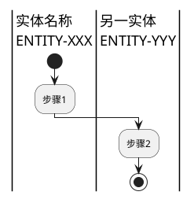

# 任务: 分析业务功能

## 输入内容
1. 接口详细信息
{{interface_info}}

2. 实体概览文件
`omni-doc/specs-temp/intermediate/entity-overview.md`


## 步骤
### 第一步：输入内容读取
- 从**接口详细信息**中读取接口ID、代码映射信息，确定所需分析流程的入口。
- 从**实体概览文件**中查找该接口ID对应的逻辑实体列表，并读取这些逻辑实体的详细信息

### 第二步：接口代码读取
- 根据接口实现代码，从入口开始按照调用关系追踪具体处理动作，读取处理动作相关代码。
- 重点关注代码中逻辑实体之间的流转关系：数据如何从一个逻辑实体转换到另一个逻辑实体。

### 第三步：基于逻辑实体识别功能点
- **功能定义原则**: 功能是串接逻辑实体，并能完整描述流程的一部分。每个功能应该描述逻辑实体之间的流转、转换或关联关系。
- **识别逻辑实体流转**: 从接口代码中识别逻辑实体之间的流转路径
  - 输入逻辑实体 → 处理 → 输出逻辑实体
  - 逻辑实体之间的关联关系建立
  - 逻辑实体的状态变更
- **功能边界识别**: 将流程划分为边界清晰的功能片段
  - ✅ 功能特征: 串接多个逻辑实体、形成完整的处理步骤、有明确的输入输出逻辑实体、业务语义统一
  - ❌ 分离条件: 涉及不同的逻辑实体组合、处理关注点明显不同、有外部交互边界、状态持久化断点
- **功能命名与描述**:
  - 为每个功能点命名，使用中文短语描述
  - 为每个功能点总结描述，描述该功能具体处理内容，输入输出等
- **功能变体处理**: 对于分支逻辑，判断是"带条件的单一功能"还是"多个变体功能"
  - 相似度高、主流程一致、串接相同的逻辑实体 → 记录为功能变体，标注各自的触发条件
  - 差异显著、串接不同的逻辑实体组合、独立价值 → 拆分为独立功能点

### 第四步：绘制泳道+活动图
- 使用plantuml绘制**活动图**，以逻辑实体作为**泳道**，描述该功能实现的业务
- 活动图应该体现逻辑实体在功能点之间的流转
- 活动图中的描述需要使用业务语言描述，不要出现代码元素
- 确保plantuml语法正确，可以正常渲染

### 第五步：整理输出
按照输出格式要求，整理所有功能信息：
- 功能ID：读取 `omni-doc/specs-temp/intermediate/function-overview.md` 中"功能详情"部分最后一个功能的ID，当前分析出的功能ID顺序递增
- 对当前分析出的每个功能，对比 `function-overview.md` 中已有功能，若功能名称和关联实体均相同，则表示为相同的功能，不再新增
- 将新功能信息按照**功能概览文件格式**追加到 `omni-doc/specs-temp/intermediate/function-overview.md` 文件中
  - 在"功能列表"表格中追加新行
  - 在"功能详情"部分追加新的功能段落
- 将该接口下的功能列表按照**接口概览表格更新格式**更新到 `omni-doc/specs-temp/intermediate/interface-overview.md` 文件中对应接口的行


## 输出格式

### **功能概览文件格式** (`function-overview.md`)
```markdown
# 功能概览

## 功能统计
- **功能总数**: [数量]

## 功能列表

| 功能ID | 功能名称 | 功能描述 | 关联实体 | 关联接口 |
|--------|---------|---------|---------|---------|
| FUNC-001 | [功能名称] | [功能描述，1-3句话] | ENTITY-001, ENTITY-002 | API-001 |
| FUNC-002 | [功能名称] | [功能描述，1-3句话] | ENTITY-003 | API-001 |

## 功能详情

### FUNC-001: [功能名称]

**描述**: [功能详细描述]

**关联实体**: ENTITY-001, ENTITY-002

**泳道活动图**:



### FUNC-002: [功能名称]
...
```

### **接口概览表格更新格式**（更新到 `interface-overview.md` 文件中）
在 `omni-doc/specs-temp/intermediate/interface-overview.md` 文件中，找到对应接口ID的行，更新该行的"功能"列：

1. **如果表格中还没有"功能"列**：
   - 在每个表格的表头行添加"功能"列（在"代码映射"列之后）
   - 更新所有表格的表头分隔行，添加对应的列分隔符
   - 在对应接口ID的行中添加"功能"列，填入功能ID列表（格式：`FUNC-001, FUNC-002`）

2. **如果表格中已有"功能"列**：
   - 直接更新对应接口ID行的"功能"列内容，填入功能ID列表（格式：`FUNC-001, FUNC-002`）

**表格格式示例**：
```markdown
| 接口ID | 接口名称 | 接口描述 | 入口标识 | 所在文件 | 代码映射 | 功能 |
|--------|----------|----------|----------|----------|----------|------|
| API-001 | 创建网络 | ... | ... | ... | ... | FUNC-001, FUNC-002 |
```

**注意事项**：
- 功能ID列表使用逗号和空格分隔（如：`FUNC-001, FUNC-002, FUNC-003`）
- 如果接口没有关联功能，功能列留空
- 确保表格格式正确，列对齐
- 更新时只修改对应接口ID的行，不要影响其他行
