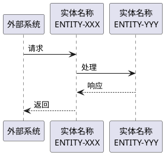

# 阶段 5：分析场景

## 输入内容
`omni-doc/specs/functions`

## 步骤

### 第一步：理解功能全貌
1. 阅读 `omni-doc/specs/functions/0.function_list.md`，了解系统所有功能的概览
2. 浏览各个功能详细文档，理解每个功能的：
   - 功能目的和处理内容
   - 输入输出及相关组件
   - 业务流程特征

### 第二步：功能聚类分析
根据业务相关性对功能进行聚类，识别场景：
1. **按业务领域分组**：将处理相同业务领域的功能归为一组
   - 如：会话管理类、查询类、网络测试类、数据处理类等

2. **按处理流程分组**：将同一业务流程中的功能归为一组
   - 如：请求接收→业务处理→响应发送的完整流程
   - 如：数据包接收→解析分发→具体处理的流水线

3. **按交互对象分组**：将与同一外部系统/组件交互的功能归为一组

4. **识别场景边界**：
   - 每个场景应该是一个完整的业务用例或业务流程
   - 场景内的功能应该有清晰的协作关系
   - 查询类功能通常与对应的管理功能归入同一场景

### 第三步：场景提炼与命名
1. **场景ID分配**：
   - ID格式：`SCN-001`、`SCN-002`、`SCN-003`...（后缀数字顺序递增）
   - ID分配规则：
     * 相关联的场景ID尽量连续
     * 按业务重要性或逻辑顺序排列

2. **场景命名**：
   - 简洁明了，体现核心业务
   - 格式建议：`[业务领域] [主要功能]`
   - 示例："会话生命周期管理"、"系统资源查询与监控"

3. **场景描述编写**：
   - **业务目的**：1-2句话说明场景解决什么问题
   - **处理内容**：概括场景包含的主要处理流程
   - **涉及功能**：列出场景包含的功能ID

### 第四步：绘制场景时序图
基于场景中的功能流程，使用PlantUML语法绘制时序图：

1. **确定参与者**：
   - 外部系统/组件
   - 当前系统的内部模块（使用逻辑实体标注，格式：`实体名称\nENTITY-XXX`）
   - 必要时包含数据库、队列等资源

2. **描绘消息流**：
   - 按照功能文档中的处理流程，标注消息传递
   - 标明请求和响应的方向
   - 体现超时、错误处理等异常流程

3. **体现时序关系**：
   - 同步调用：使用实线箭头
   - 异步调用：使用虚线箭头
   - 并行处理：使用 par/end 标记
   - 条件分支：使用 alt/else/end 标记
   - 循环处理：使用 loop/end 标记
   - 不同流程：使用 `== 流程名称 ==` 分隔

4. **详细程度把控**：
   - 体现场景的主要处理流程即可
   - 对于复杂的子流程可适当简化
   - 重点突出关键的消息交互和状态变化

### 第五步：关联功能清单
为每个场景整理包含的功能ID列表：
- 按照功能在场景中的执行顺序排列
- 使用逗号分隔功能ID
- 确保功能ID与 `omni-doc/specs/functions` 中的ID一致

### 第六步：整理输出
按照**输出格式**整理所有场景信息到 `omni-doc/specs-temp/intermediate/scenario-overview.md`

**输出策略（避免完整输出失败）**：
1. **分步输出**：如果场景数量较多，分批次输出（每次5-10个场景）
   - 先创建文件头部（统计信息和列表表格）
   - 逐个或分批追加场景详情
2. **输出后验证**：检查 Markdown 格式正确性、PlantUML 语法完整性

### 第七步：概览 DoD 校验
生成概览文件后，执行以下校验，全部通过方可结束本阶段：

1. **ID 唯一性**：所有 `SCN-XXX` ID 无重复
2. **ID 连续性**：ID 序列基本连续（允许少量跳号，不应大段缺失）
3. **场景列表字段完整性**：表格每行的 4 个字段（场景ID、场景名称、场景描述、关联功能）均非空
4. **详情段落覆盖**："场景列表"表格中的每个 SCN-ID，在"场景详情"部分都有对应的三级标题段落
5. **详情结构完整**：抽样检查 3-5 个场景详情段落，确认包含"描述"、"关联功能"、"时序图"（含 plantuml 代码块）
6. **统计一致性**："场景统计"中的场景总数与"场景列表"表格的实际行数一致
7. **功能全覆盖**：从 `omni-doc/specs/functions/0.function_list.md` 提取所有 FUNC-ID，确认每个功能至少归属于一个场景的"关联功能"中

如果发现问题，就地修复后重新校验，直到全部通过。

## 分析要点
- **完整性**：确保所有功能都有对应的场景归属，不遗漏任何功能
- **准确性**：场景识别必须基于功能文档的实际描述，不能主观臆断
- **合理性**：场景粒度要合理，既不能过于宏观笼统，也不能过于细碎
- **可读性**：场景名称和描述要清晰易懂，时序图要能够直观表达业务流程
- **可追溯性**：每个场景都要明确列出包含的功能ID，便于后续追溯

## 输出格式
### **场景概览文件格式** (`scenario-overview.md`)
```markdown
# 场景概览

## 场景统计
- **场景总数**: [数量]

## 场景列表

| 场景ID | 场景名称 | 场景描述 | 关联功能 |
|--------|---------|---------|---------|
| SCN-001 | [场景名称] | [场景描述，1-3句话] | FUNC-001, FUNC-002 |
| SCN-002 | [场景名称] | [场景描述，1-3句话] | FUNC-003, FUNC-004 |

## 场景详情

### SCN-001: [场景名称]

**描述**: [场景详细描述]

**关联功能**: FUNC-001, FUNC-002

**时序图**:



### SCN-002: [场景名称]
...
```
