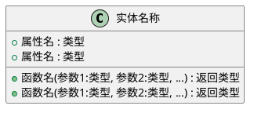

# 实施计划: [FEATURE]

**分支**: `[###-feature-name]` | **日期**: [DATE] | **规范**: [link]
**输入**: 来自 `/changes/[###-feature-name]/spec.md` 的功能规范

**注意**: 此模板由 `/omni.design` 命令填充.

## 摘要

[从功能规范中提取: 主要需求 + 研究得出的技术方法]

## 技术背景

<!--
  需要操作: 将此部分内容替换为项目的技术细节.
  此处的结构以咨询性质呈现, 用于指导迭代过程.
-->

**语言/版本**: [例如: Python 3.11、Swift 5.9、Rust 1.75 或 NEEDS CLARIFICATION]
**主要依赖**: [例如: FastAPI、UIKit、LLVM 或 NEEDS CLARIFICATION]
**存储**: [如适用, 例如: PostgreSQL、CoreData、文件 或 N/A]
**测试**: [例如: pytest、XCTest、cargo test 或 NEEDS CLARIFICATION]
**目标平台**: [例如: Linux 服务器、iOS 15+、WASM 或 NEEDS CLARIFICATION]
**项目类型**: [单一/网页/移动 - 决定源代码结构]
**性能目标**: [领域特定, 例如: 1000 请求/秒、10k 行/秒、60 fps 或 NEEDS CLARIFICATION]
**约束条件**: [领域特定, 例如: <200ms p95、<100MB 内存、离线可用 或 NEEDS CLARIFICATION]
**规模/范围**: [领域特定, 例如: 10k 用户、1M 行代码、50 个屏幕 或 NEEDS CLARIFICATION]

## 章程检查

*门控: 必须在阶段 0 研究前通过. 阶段 1 设计后重新检查. *

[基于章程文件确定的门控条件]

## 项目结构

### 文档(此功能)

```
changes/[###-feature]/
├── design.md              # 此文件 (/omni.design 命令输出)
├── research.md          # 阶段 0 输出 (/omni.design 命令)
├── data-model.md        # 阶段 1 输出 (/omni.design 命令)
├── quickstart.md        # 阶段 1 输出 (/omni.design 命令)
├── contracts/           # 阶段 1 输出 (/omni.design 命令)
└── tasks.md             # 阶段 2 输出 (/omni.tasks 命令 - 非 /omni.design 创建)
```

### 源代码(仓库根目录)
<!--
  需要操作: 将下面的占位符树结构替换为此功能的具体布局.
  删除未使用的选项, 并使用真实路径(例如: apps/admin、packages/something)扩展所选结构.
  交付的计划不得包含选项标签.
-->

```
# [如未使用请删除] 选项 1: 单一项目(默认)
src/
├── models/
├── services/
├── cli/
└── lib/

tests/
├── contract/
├── integration/
└── unit/

# [如未使用请删除] 选项 2: Web 应用程序(检测到"前端" + "后端"时)
backend/
├── src/
│   ├── models/
│   ├── services/
│   └── api/
└── tests/

frontend/
├── src/
│   ├── components/
│   ├── pages/
│   └── services/
└── tests/

# [如未使用请删除] 选项 3: 移动端 + API(检测到 "iOS/Android" 时)
api/
└── [同上后端结构]

ios/ 或 android/
└── [平台特定结构: 功能模块、UI 流程、平台测试]
```

**结构决策**: [记录所选结构并引用上面捕获的真实目录]

## 逻辑实体

###  [动作类型:INSERT/MODIFY/DELETE/REFER] - [实体id，格式：ENTITY-XXX]([实体名称])

**变更原因**: [变更的来源，变更方法等]

**实体结构**: 


**属性说明**:

[属性1]
- **类型**: [数据类型，如 结构体类型、基本类型等]
- **用途**: [属性的业务用途]
- **取值范围**: [可选，如 枚举值、数值范围等]
- **约束条件**: [可选，如 非空、唯一性等]


**方法说明**:

[方法1]
- **函数签名**: [完整的函数签名，包括参数和返回值]
- **功能描述**: [方法的主要功能和处理逻辑]
- **输入参数**: [参数说明]
- **返回值**: [返回值说明]
- **调用场景**: [方法被调用的场景和上下文]


**职责说明**(可选):

[详细说明实体的核心职责，包括：
- 主要处理哪些业务逻辑
- 与其他实体的交互关系
- 在系统中的定位和作用
]

###  [动作类型:INSERT/MODIFY/DELETE/REFER] - [实体id，格式：ENTITY-XXX]([实体名称])

[按照上述格式继续描述其他实体...]

## 功能

### [动作类型，INSERT/MODIFY/DELETE/REFER] - [动作id，格式：FUNC-XXX] - [功能名称](优先级: P1)

**来源场景**: [SCN-XXX] - [场景描述]

**关联逻辑实体**: [ENTITY-XXX] - [逻辑实体描述]

**优先级**: [P1/P2/P3] - [优先级原因]

**功能描述**: 
[从对应场景的验收场景中提取，描述该功能需要实现的具体能力]

**输入**: 
- [输入1: 描述输入数据的来源和格式]
- [输入2: 描述输入数据的来源和格式]

**输出**: 
- [输出1: 描述输出数据的格式和去向]
- [输出2: 描述输出数据的格式和去向]

**技术要点**: 
- [实现该功能需要注意的技术细节]
- [可能涉及的关键实体和接口]

### [动作类型，INSERT/MODIFY/DELETE/REFER] - [动作id，格式：FUNC-XXX] - [功能名称](优先级: P2)

[按照上述格式继续描述其他功能...]

## 复杂度跟踪

*仅在章程检查有必须证明的违规时填写*

| 违规 | 为什么需要 | 拒绝更简单替代方案的原因 |
|-----------|------------|-------------------------------------|
| [例如: 第 4 个项目] | [当前需求] | [为什么 3 个项目不够] |
| [例如: 仓储模式] | [特定问题] | [为什么直接数据库访问不够] |
